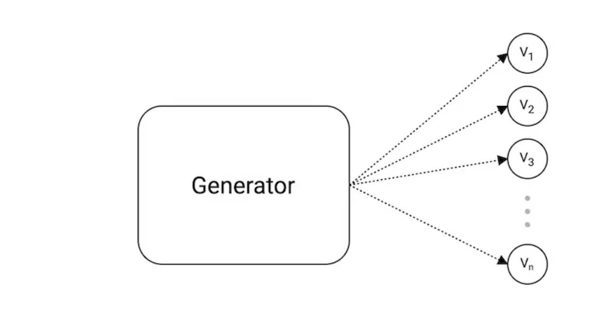
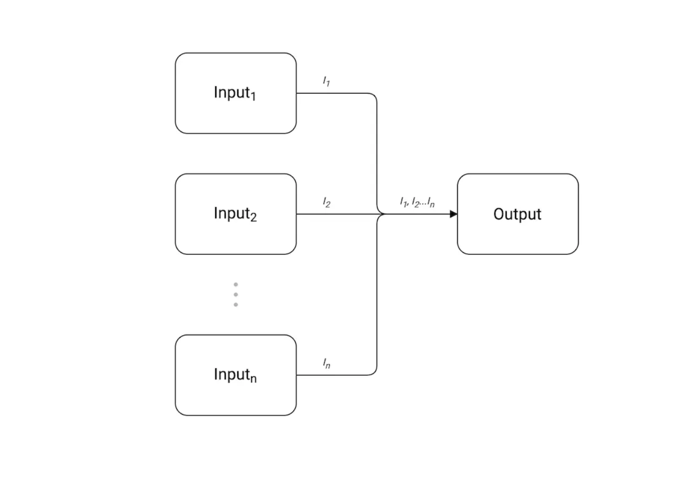
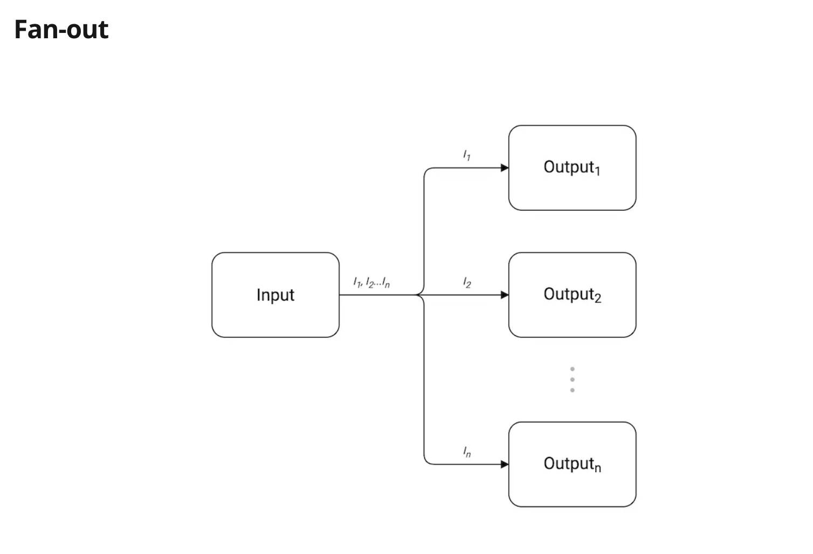
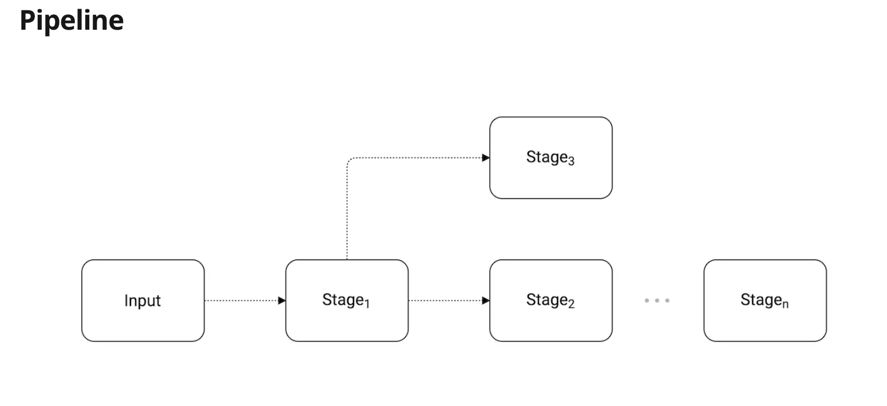
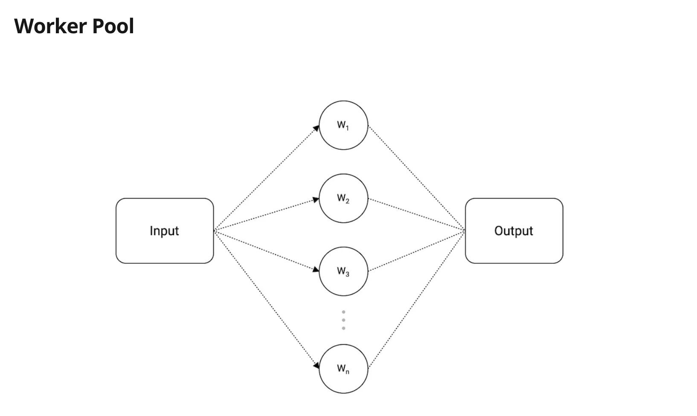
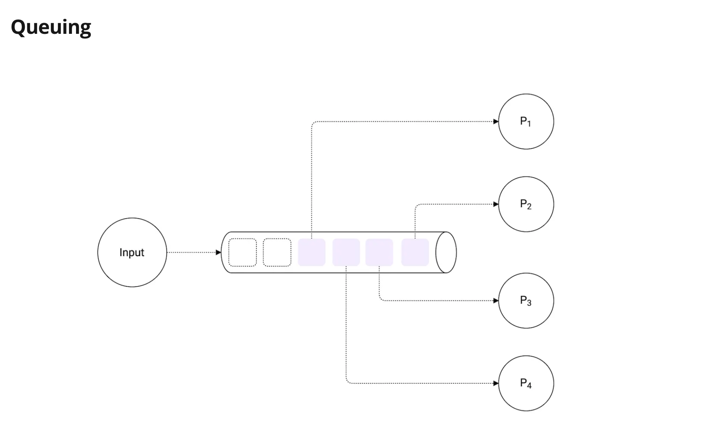

# Concurrency Patterns 

## Generator [code](Generator/generator.go)

Generator Pattern is used to generate a sequence of values which is used to produce some output.

<picuture></img>
</picture>

## Fan-in [code](Fan-in/fanin.go)

The fan-in pattern combines multiple inputs into one single output channel. Basically, we multiplex our inputs.

<picuture></img>
</picture>

## Fan-out [code](Fan-out/fanout.go)

<picuture></img>
</picture>

## Pipeline [code](Pipeline/pipeline.go)

<picuture></img>
</picture>

## Worker Pool [code](Workerpool/workerpool.go)

<picuture></img>
</picture>

## Queueing [code](Queuing/queuing.go)
Queuing pattern allows us to process n number of items at a time.

<picuture></img>
</picture>

## References 
1. https://www.karanpratapsingh.com/blog/learn-go-the-complete-course