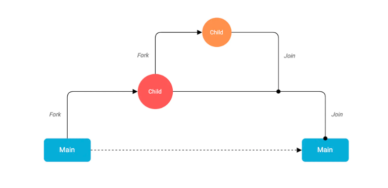

# Goroutine in Golang 

* A goroutine is a lightweight thread of execution that is managed by the Go runtime and essentially let us write asynchronous code in a synchronous manner.

* It is important to know that they are not actual OS threads and the main function itself runs as a goroutine.

* A single thread may run thousands of goroutines in them by using the Go runtime scheduler which uses cooperative scheduling. 

* This implies that if the current goroutine is blocked or has been completed, the scheduler will move the other goroutines to another OS thread. Hence, we achieve efficiency in scheduling where no routine is blocked forever.

* We can turn any function into a goroutine by simply using the go keyword.
`go fn(x, y, z)`

## Fork-Join Model

<picture> </img> </picture>

Go uses the idea of the fork-join model of concurrency behind goroutines. The fork-join model essentially implies that a child process splits from its parent process to run concurrently with the parent process. After completing its execution, the child process merges back into the parent process. The point where it joins back is called the join point.

```go
package main

import "fmt"

func speak(arg string) {
	fmt.Println(arg)
}

func main() {
	go speak("Hello World")
}
```


